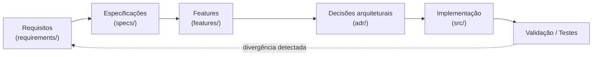

# Studia — Documentação do Projeto

> **Studia** é um aplicativo mobile de organização de estudos (matérias, atividades, avaliações e
> progresso), desenvolvido em **Expo + React Native + TypeScript** como Projeto Final da disciplina
> *Desenvolvimento de Sistemas para Dispositivos Móveis* e como projeto de portfólio.

Esta pasta é a **fonte de verdade** do produto (ver [`.clinerules`](../.clinerules) → Regra 0). O fluxo que
governa tudo:

## Índice

| Documento | Conteúdo | Status |
|---|---|---|
| [`product-brief.md`](product-brief.md) | Produto, problema, público, proposta de valor, escopo aprovado e fora de escopo definitivo | **Aprovado** (2026-10-07) |
| [`requirements/functional-requirements.md`](requirements/functional-requirements.md) | RF-01 … RF-09 | **Aprovado como base** (2026-10-07) |
| [`requirements/non-functional-requirements.md`](requirements/non-functional-requirements.md) | RNF-01 … RNF-06 | **Aprovado como base** (2026-10-07) |
| [`requirements/open-questions.md`](requirements/open-questions.md) | Questões em aberto que bloqueiam ou orientam a implementação | Ativo — 9 resolvidas, 3 em aberto (contexto) |
| [`architecture/domain-model.md`](architecture/domain-model.md) | Entidades, atributos, chaves, relacionamentos, cardinalidades, diagrama | **Aprovado** (2026-10-07; `Subject.color` em 2026-10-08) |
| [`architecture/screens-and-navigation.md`](architecture/screens-and-navigation.md) | 7 telas: objetivo, dados, navegação e fluxo | **Aprovado como base** (2026-10-07; telas revisadas em 2026-10-08) |
| [`architecture/architecture.md`](architecture/architecture.md) | Camadas, mapeamento para Expo Router, dados por tela, SOLID pragmático | **Aprovado** (2026-10-07) |
| [`design/visual-identity.md`](design/visual-identity.md) | Tokens da identidade escura, cor de destaque, paleta de matérias, tipografia, estados | **Aprovado** (2026-10-08, [ADR-0009](adr/ADR-0009-identidade-visual-escura-com-destaque.md)) |
| [`adr/`](adr/README.md) | ADR-0001 … ADR-0009 | **Aceitos** (0006 substituído pelo 0009) |
| [`features/`](features/README.md) | Divisão em 5 features; `ui-kit` com spec escrita | Proposto (1 implementada) |
| [`specs/`](specs/README.md) | Fluxo SDD por mudança (spec → plan → tasks) e templates | Ativo |
| [`execution-prompts.md`](execution-prompts.md) | Prompts de implementação prontos para o agente executor (apodex-1.1-mini) | Ativo |

## Regras de leitura para agentes de IA

A ordem de autoridade está em [`.clinerules`](../.clinerules) Regra 0. Em resumo, antes de implementar
qualquer coisa, leia: (1) os RF/RNF envolvidos; (2) o ADR do tema; (3) a spec da feature; (4)
[`architecture/architecture.md`](architecture/architecture.md). Se a informação não existir, **registre
uma questão** em [`requirements/open-questions.md`](requirements/open-questions.md) em vez de assumir.

## Cobertura do roteiro acadêmico

O `Roteiro Projeto Final.pdf` exige um **documento único da Etapa 1** (capa, introdução, requisitos,
telas, protótipo, modelagem, diagrama, dados, tecnologias, conclusão). Os arquivos canônicos acima são a
fonte; o documento de entrega (PDF com capa e nomes da dupla) será **gerado a partir destes arquivos** na
Etapa 7 — nunca editado como fonte separada.

| Item do roteiro | Onde é respondido |
|---|---|
| 1–2. Tema, problema, público, objetivo | [`product-brief.md`](product-brief.md) |
| 3. Requisitos (≥6 RF, ≥4 RNF) | [`requirements/functional-requirements.md`](requirements/functional-requirements.md), [`requirements/non-functional-requirements.md`](requirements/non-functional-requirements.md) |
| 4. Telas e fluxo de navegação (≥5) | [`architecture/screens-and-navigation.md`](architecture/screens-and-navigation.md) |
| 5. Protótipo das telas | A produzir fora do repositório ([OQ-08](requirements/open-questions.md)); capturas irão em `docs/prototype/` |
| 6–8. Modelagem, relacionamentos, diagrama (≥3 entidades) | [`architecture/domain-model.md`](architecture/domain-model.md) |
| 9. Dados utilizados (API ou armazenamento local) | [`adr/ADR-0002-estrategia-de-persistencia.md`](adr/ADR-0002-estrategia-de-persistencia.md) + seção "Dados por tela" de [`architecture/screens-and-navigation.md`](architecture/screens-and-navigation.md) |
| 10. Componentes reutilizáveis + proposta de pastas | [`features/README.md`](features/README.md) (UI Kit) + [`architecture/architecture.md`](architecture/architecture.md) |
| 11. Tecnologias | [`adr/ADR-0001-stack-expo-react-native-typescript.md`](adr/ADR-0001-stack-expo-react-native-typescript.md) |

## Convenções

- **Idioma:** documentação em português; código, identificadores e nomes de arquivo em inglês (termos de
  domínio traduzidos no modelo de domínio).
- **Estados de documento:** *Rascunho* → *Proposto* → *Aprovado* → *Implementado* → *Superado*.
  Documento aprovado não muda sem justificativa registrada (`.clinerules` Regras 2 e 9).
- **Classificação de afirmações:** requisito / decisão / hipótese / sugestão — sempre nomeada
  (`.clinerules` Regra 0).
- **`docs/prototype/` e `docs/entrega/`:** diretórios de apoio (capturas do protótipo e documento único de
  entrega, derivado). Não são fontes de verdade.
