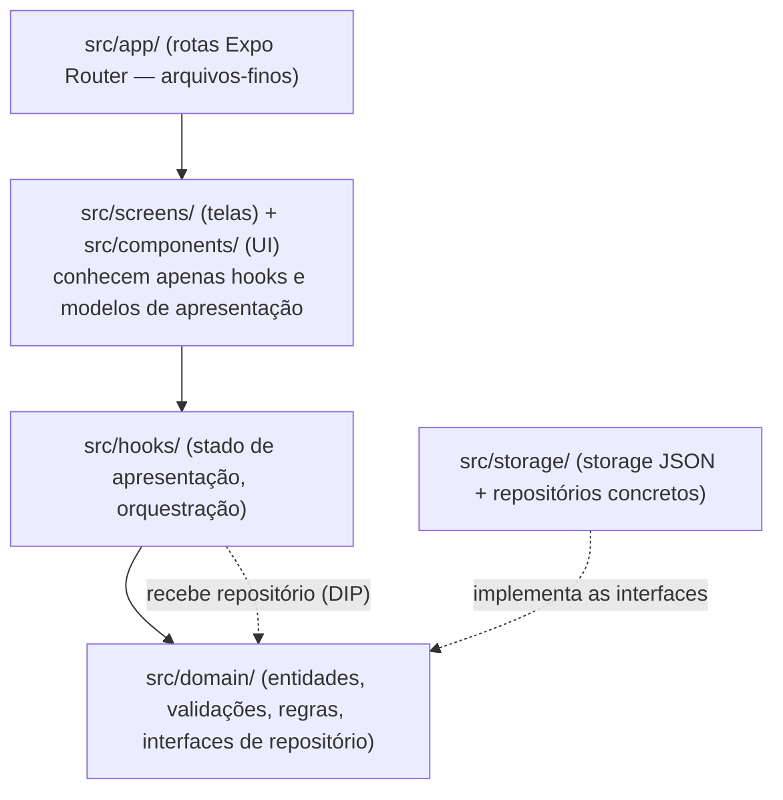

# Arquitetura — Studia

| Campo | Valor |
|---|---|
| **Status** | **Aprovado** (2026-10-07) — MVP acadêmico autocontido, sem fase pós-MVP; estrutura revisada pelo ADR-0008 |
| **Decisão-mãe** | [ADR-0004](../adr/ADR-0004-organizacao-arquitetural.md) (camadas/DIP) + [ADR-0008](../adr/ADR-0008-estrutura-roteiro.md) (nomes de pastas) |
| **Ponto de partida** | Scaffold Expo SDK 57 + Expo Router já instalado (`src/app/`, `src/components/`, `src/constants/theme.ts`) |

## Princípio norte

> O tamanho do app manda. Studia é um CRUD local com 3 entidades e 7 telas. A arquitetura existe para
> separar **UI**, **regra de negócio** e **persistência** — nem para virar `App.tsx` monolítico, nem para
> imitar um enterprise. Cada pasta abaixo precisa justificar-se; a estrutura respeita os nomes do
> roteiro (Etapa 2, item 5) sempre que não conflitar com a stack.

## Estrutura de camadas



Regra de dependência: **setas apontam para dentro**. Telas/hooks nunca importam `src/storage/`;
`src/domain/` não importa React nem storage.

## Árvore de arquivos (implementada — ADR-0008)

```
src/
├── app/                      # ROTAS (Expo Router) — layouts + re-exports finos, zero lógica
│   ├── _layout.tsx           # providers globais (tema) + Stack de modais
│   ├── (tabs)/
│   │   ├── _layout.tsx       # bottom tabs (Painel, Matérias, Atividades, Avaliações)
│   │   ├── index.tsx         # → screens/dashboard (T1)
│   │   ├── subjects.tsx      # → screens/subjects (T2)
│   │   ├── activities.tsx    # → screens/activities (T3)
│   │   └── assessments.tsx   # → screens/assessments (T4)
│   ├── subject-form.tsx      # → screens/subject-form (T5)
│   ├── activity-form.tsx     # → screens/activity-form (T6)
│   └── assessment-form.tsx   # → screens/assessment-form (T7)
├── screens/                  # IMPLEMENTAÇÃO das telas — uma por arquivo, nome explícito
├── components/               # UI reutilizável (≥3 exigidos pelo roteiro)
│   └── ui/                   # Button, Input, Card, ListItem, EmptyState, Badge, Divider,
│                             # ScreenHeader, ProgressBar, Monogram
├── hooks/                    # use-subjects, use-activities (+ use-dashboard no P5)
├── domain/                   # regras puras, sem React
│   ├── models.ts             # Subject, Activity, Assessment + tipos auxiliares
│   ├── validation.ts         # validadores de formulário (RF-01, RF-04, RF-08)
│   ├── progress.ts           # cálculo de progresso/agregados (RF-02/RF-09)
│   ├── date.ts / id.ts / monogram.ts / sorting.ts
│   └── repositories.ts       # INTERFACES Repository<Subject> etc. (portos)
├── storage/                  # persistência (adaptadores) — nome do roteiro
│   ├── storage.ts            # wrapper AsyncStorage: chaves, get/set JSON atômicos
│   ├── notifier.ts           # pub/sub mínimo "dados mudaram" (cross-screen refresh)
│   ├── subject.repository.ts # implementa Repository<Subject>
│   ├── activity.repository.ts
│   └── assessment.repository.ts
├── styles/global.css         # tokens CSS do NativeWind (ADR-0007) — nome do roteiro
└── constants/theme.ts        # tokens numéricos legados (Spacing etc. para casos dinâmicos)
```

### O que o roteiro/enunciado sugere vs. o que ficou — e por quê

| Camada sugerida | Decisão | Justificativa |
|---|---|---|
| `screens/` | **adotada (ADR-0008)** | Implementação das telas em `src/screens/`, com `src/app/` guardando só rotas finas (re-export). Satisfaz o roteiro e mantém o Expo Router feliz: a rota é a URL, a tela é o código. |
| `storage/` | **adotada (ADR-0008)** | Nome literal do roteiro; abriga wrapper AsyncStorage + repositórios. (A renomeação anterior para `data/` foi revertida: custo zero, ganho de leitura na avaliação.) |
| `styles/` | **adotada (ADR-0008)** | `src/styles/global.css` (tokens NativeWind). `constants/theme.ts` permanece para valores numéricos usados em runtime (safe-area, dimensões dinâmicas). |
| `repositories/` | **dividida: interface em `domain/`, implementação em `storage/`** | A interface é contrato de negócio (porto); a implementação é detalhe técnico (adaptador). DIP sem pasta extra decorativa. |
| `models/` | **fundida em `domain/models.ts`** | Um arquivo de tipos não precisa de diretório; modelos vivem junto das regras que os validam. |
| `services/` | **não existe — decisão final** | Sem API externa ([ADR-0002](../adr/ADR-0002-estrategia-de-persistencia.md)); o app é 100% local. Na apresentação: `domain/` é a camada equivalente (regras de negócio). |
| `components/`, `hooks/`, `utils/` | mantidas | Responsabilidade real; `utils/` ainda não nasceu — funções entraram em `domain/` (date, id) onde são regras, não utilidades. |

## SOLID — pragmaticamente

Cada princípio abaixo tem problema real resolvido; nenhum é demonstração.

| Princípio | Onde se aplica | Problema que resolve |
|---|---|---|
| **SRP** | `domain/validation.ts` (só regras), `storage/storage.ts` (só persistência), um hook por agregado, um componente por responsabilidade | O "todo-poderoso `App.tsx`" que o roteiro cita como anti-padrão; mudança de validação não arrasta UI. |
| **OCP** | Componentes UI parametrizados por props (variantes de `Button`/`Badge`); repositórios por interface | Novas necessidades visuais/de dados estendem props/implementações em vez de remendar código de telas antigas. |
| **LSP** | Repositórios concretos (`subject.repository` etc.) são intercambiáveis entre si e com fakes de teste porque respeitam `Repository<T>` | Hooks funcionam contra fakes em teste/preview sem saber que é storage — condição para RNF-04 ser testável. |
| **ISP** | Interfaces enxutas: um `Repository<T>` com `getAll/upsert/remove` — sem método "de dashboard" dentro | Nada é forçado a implementar método que não usa (ex.: repositório não calcula progresso — isso é `domain/progress.ts`). |
| **DIP** | Hooks dependem da **interface** `Repository<T>` (em `domain/`); a implementação AsyncStorage mora em `storage/` e é plugada no ponto de composição | Telas/hooks nunca importam storage; regras de negócio testáveis com fakes de repositório (RNF-04 verificável). É o princípio que separa UI ↔ negócio ↔ persistência, exigência explícita do cliente. |

**Separação tripla exigida pelo cliente** (UI ↔ regras ↔ persistência) é exatamente o grafo de
dependências do diagrama acima: rota → tela → hook → domínio, e o domínio define o contrato que
`storage/` implementa.

## Decisões de mecanismo (onde moram)

- Stack/versionamento Expo → [ADR-0001](../adr/ADR-0001-stack-expo-react-native-typescript.md)
- AsyncStorage vs SQLite vs API → [ADR-0002](../adr/ADR-0002-estrategia-de-persistencia.md)
- Expo Router vs React Navigation vs Navigator → [ADR-0003](../adr/ADR-0003-estrategia-de-navegacao.md)
- Camadas + DIP → [ADR-0004](../adr/ADR-0004-organizacao-arquitetural.md)
- Estado global vs hooks de dados locais → [ADR-0005](../adr/ADR-0005-gerenciamento-de-estado.md)
- Identidade monocromática → [ADR-0006](../adr/ADR-0006-identidade-visual-monocromatica.md)
- NativeWind/Tailwind → [ADR-0007](../adr/ADR-0007-estilo-nativewind.md)
- Nomes de pastas do roteiro → [ADR-0008](../adr/ADR-0008-estrutura-roteiro.md)
- Nomes de rotas concretas, estados de loading, detalhes de componentes → **spec de cada feature**
  (`docs/features/`), não aqui.
