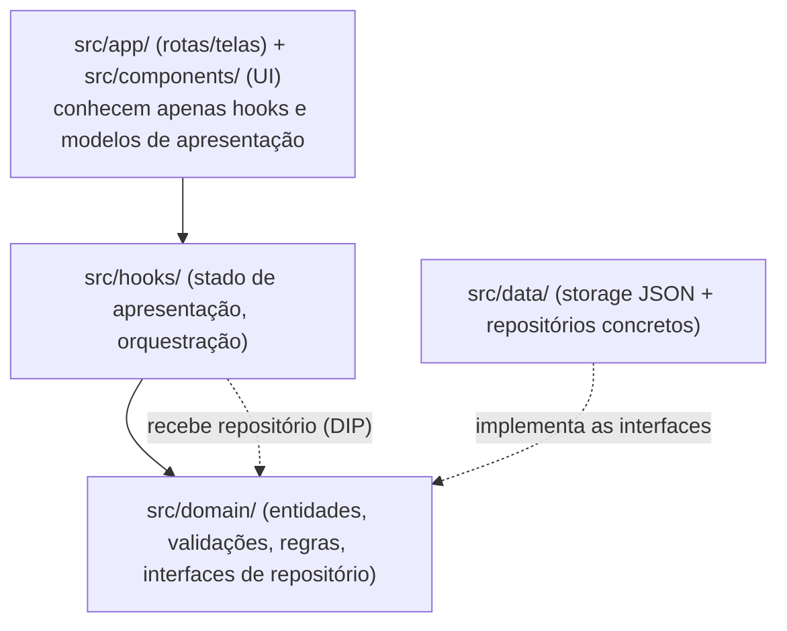

# Arquitetura — Studia

| Campo | Valor |
|---|---|
| **Status** | **Aprovado** (2026-10-07) — MVP acadêmico autocontido, sem fase pós-MVP |
| **Decisão-mãe** | [ADR-0004](../adr/ADR-0004-organizacao-arquitetural.md) |
| **Ponto de partida** | Scaffold Expo SDK 57 + Expo Router já instalado (`src/app/`, `src/components/`, `src/constants/theme.ts`) |

## Princípio norte

> O tamanho do app manda. Studia é um CRUD local com 3 entidades e 7 telas. A arquitetura existe para
> separar **UI**, **regra de negócio** e **persistência** — nem para virar `App.tsx` monolítico, nem para
> imitar um enterprise. Cada pasta abaixo precisa justificar-se; camadas do enunciado do cliente que não
> se aplicam foram removidas com motivo declarado.

## Estrutura de camadas (proposta)



Regra de dependência: **setas apontam para dentro**. UI nunca importa `src/data/`; `src/domain/` não
importa React nem storage.

## Árvore de arquivos

```
src/
├── app/                      # ROTAS (Expo Router) — só telas/layout, zero lógica de negócio
│   ├── _layout.tsx           # providers globais (tema) — fino
│   ├── (tabs)/
│   │   ├── _layout.tsx       # bottom tabs (Painel, Matérias, Atividades, Avaliações)
│   │   ├── index.tsx         # T1 Painel
│   │   ├── subjects.tsx      # T2 Matérias
│   │   ├── activities.tsx    # T3 Atividades
│   │   └── assessments.tsx   # T4 Avaliações
│   ├── subject-form.tsx      # T5
│   ├── activity-form.tsx     # T6
│   └── assessment-form.tsx   # T7
├── components/               # UI reutilizável (≥3 exigidos — ver §Componentes)
│   ├── ui/                   # Button, Input/FormField, Card, ListItem, EmptyState, Badge
│   └── domain/               # SubjectCard, ActivityItem, ProgressBar, DeadlineBadge
├── hooks/                    # useSubjects, useActivities, useAssessments, useDashboard
├── domain/                   # regras puras, sem React
│   ├── models.ts             # Subject, Activity, Assessment + tipos auxiliares
│   ├── validation.ts         # validadores de formulário (RF-01, RF-04, RF-08)
│   ├── progress.ts           # cálculo de progresso/agregados (RF-02/RF-09)
│   └── repositories.ts       # INTERFACES Repository<Subject> etc. (portos)
├── data/                     # persistência (adaptadores)
│   ├── storage.ts            # wrapper AsyncStorage: chaves, get/set JSON atômicos
│   ├── notifier.ts           # pub/sub mínimo "dados mudaram" (cross-screen refresh)
│   ├── subject.repository.ts # implementa Repository<Subject>
│   ├── activity.repository.ts
│   └── assessment.repository.ts
├── constants/theme.ts        # tokens monocromáticos (ADR-0006) — estender per docs/design/visual-identity.md
└── utils/                    # datas (formato DD/MM/AAAA, "em 2 dias") — criar só quando necessário
```

### O que o enunciado sugeriu vs. o que ficou — e por quê

| Camada sugerida | Decisão | Justificativa |
|---|---|---|
| `screens/` | **absorvida em `app/`** | Expo Router *é* o screens: cada arquivo de rota é a tela. Ter `screens/` + rotas finas duplicaria indirection sem ganho. |
| `storage/` | **renomeada `data/`** | Abriga wrapper de storage + repositórios; "storage/" descrevia ferramenta, não responsabilidade. |
| `repositories/` | **dividida: interface em `domain/`, implementação em `data/`** | A interface é contrato de negócio (porto); a implementação é detalhe técnico (adaptador). É assim que DIP funciona em projeto pequeno, sem pasta extra só para "parecer limpa". |
| `models/` | **fundida em `domain/models.ts`** | Um arquivo de tipos não precisa de diretório; modelos vivem junto das regras que os validam. |
| `services/` | **não existe — decisão final** | Sem API externa ([ADR-0002](../adr/ADR-0002-estrategia-de-persistencia.md)); o app é 100% local e o escopo não tem fase futura. "Service" viraria sinônimo vago de repository. |
| `hooks/`, `components/`, `utils/`, `styles/` (→ `constants/theme.ts`) | mantidas | Já presentes no scaffold e com responsabilidade real. Estilos: tokens centrais + `StyleSheet` por componente — sem `styles/` global espelhando componentes. |

## SOLID — pragmaticamente

Cada princípio abaixo tem problema real resolvido; nenhum é demonstração.

| Princípio | Onde se aplica | Problema que resolve |
|---|---|---|
| **SRP** | `domain/validation.ts` (só regras), `data/storage.ts` (só persistência), um hook por agregado, um componente por responsabilidade | O "todo-poderoso `App.tsx`" que o roteiro cita como anti-padrão; mudança de validação não arrasta UI. |
| **OCP** | Componentes UI parametrizados por props (variantes de `Button`/`Badge`); repositórios por interface | Novas necessidades visuais/de dados estendem props/implementações em vez de remendar código de telas antigas. |
| **LSP** | Repositórios concretos (`SubjectRepository` etc.) são intercambiáveis entre si e com fakes de teste porque respeitam `Repository<T>` | Hooks funcionam contra fakes em teste/preview sem saber que é storage — condição para RNF-04 ser testável. |
| **ISP** | Interfaces enxutas: um `Repository<T>` com `getAll/save/remove` — sem método "de dashboard" dentro | Nada é forçado a implementar método que não usa (ex.: repositório não precisa saber calcular progresso — isso é `domain/progress.ts`). |
| **DIP** | Hooks dependem da **interface** `Repository<T>` (em `domain/`); a implementação AsyncStorage mora em `data/` e é plugada no ponto de composição | Telas/hooks nunca importam storage; regras de negócio testáveis com fakes de repositório (RNF-04 verificável). É o princípio que separa UI ↔ negócio ↔ persistência, exigência explícita do cliente. |

**Separação tripla exigida pelo cliente** (UI ↔ regras ↔ persistência) é exatamente o grafo de dependências
do diagrama acima: UI olha para hooks, hooks para domínio, domínio define o contrato que data implementa.

## Decisões de mecanismo (onde moram)

- Stack/versionamento Expo → [ADR-0001](../adr/ADR-0001-stack-expo-react-native-typescript.md)
- AsyncStorage vs SQLite vs API → [ADR-0002](../adr/ADR-0002-estrategia-de-persistencia.md)
- Expo Router vs React Navigation vs Navigator → [ADR-0003](../adr/ADR-0003-estrategia-de-navegacao.md)
- Esta estrutura de camadas → [ADR-0004](../adr/ADR-0004-organizacao-arquitetural.md)
- Estado global vs hooks de dados locais → [ADR-0005](../adr/ADR-0005-gerenciamento-de-estado.md)
- Nomes de rotas concretas, estados de loading, detalhes de componentes → **spec de cada feature**
  (`docs/features/`), não aqui.
