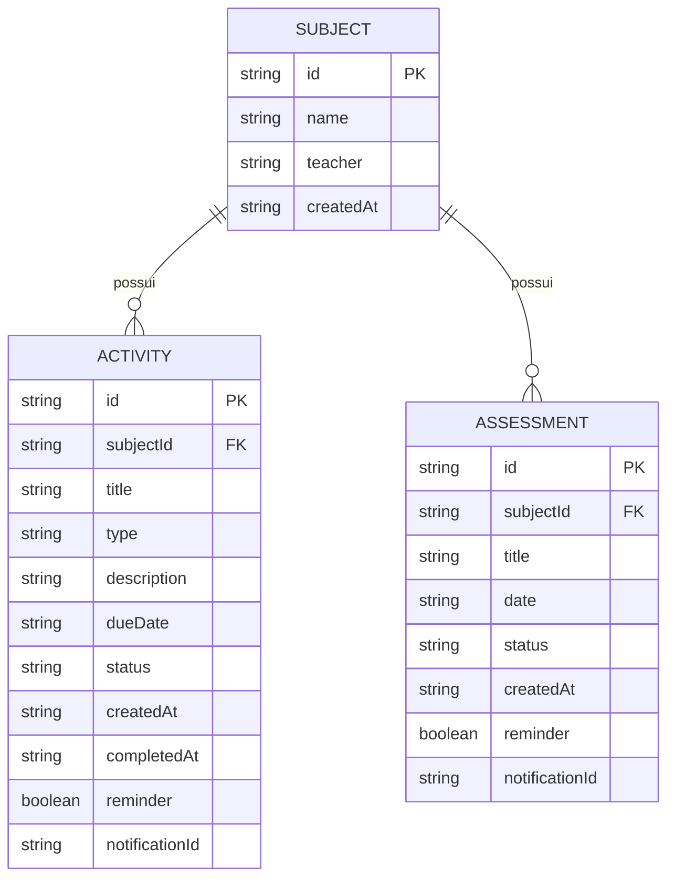
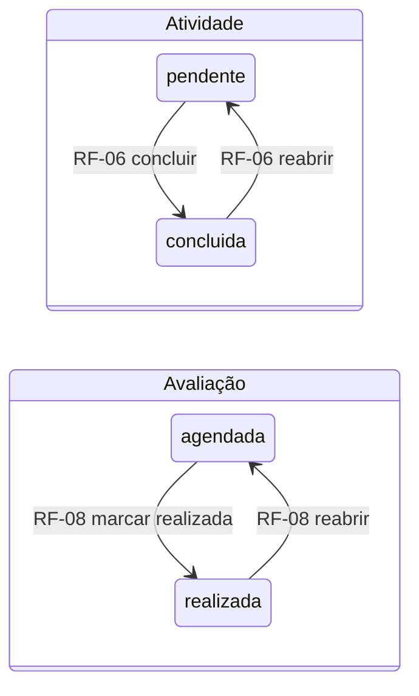

# Modelo de Domínio — Studia

| Campo | Valor |
|---|---|
| **Status** | **Aprovado** (2026-10-07) — revisited em 2026-10-08: `Subject` ganhou `hour`, `icon` (Slice 6) e `color` ([ADR-0009](../adr/ADR-0009-identidade-visual-escura-com-destaque.md)); em 2026-10-09 (Slice 8): `Activity`/`Assessment` ganharam `reminder` e `notificationId` |
| **Origem** | Roteiro Etapa 1, itens 6–7 (≥3 entidades relacionadas, PK/FK, cardinalidade) |
| **Termos** | Código em inglês; este documento mantém o par PT ↔ EN — o produto é PT, o código é EN |

## Visão geral

Três entidades, cada uma com responsabilidade própria — nenhuma criada para "encher" o mínimo do roteiro:

| Entidade | PT (produto/UI) | EN (código) | Responsabilidade |
|---|---|---|---|
| **Matéria** | Matéria | `Subject` | Agrupar a vida acadêmica do usuário; dona de atividades e avaliações |
| **Atividade** | Atividade | `Activity` | Item de trabalho com prazo e situação (o "o que fazer"); produz o progresso |
| **Avaliação** | Avaliação | `Assessment` | Evento avaliativo datado (prova/seminário/entrega); o "quando serei cobrado" |

Atividade × Avaliação são entidades separadas porque têm naturezas diferentes: a primeira é executada e
concluída pelo estudante; a segunda é um marco datado imposto pelo curso. Unificá-las exigiria campos
opcionais confusos e validações ambíguas — viola SRP.

## Entidades

### Subject (Matéria)

| Campo | Tipo | Chave | Finalidade |
|---|---|---|---|
| `id` | `string` (UUID) | **PK** | Identificador estável entre coleções |
| `name` | `string` | — | Nome exibido; obrigatório, ≥2 caracteres, único (case-insensitive) |
| `teacher` | `string \| null` | — | Professor(a); opcional |
| `hour` | `number \| null` | — | Horas por semana; opcional (Slice 6) |
| `icon` | `string \| null` | — | Nome do ícone (grade de 12); opcional (Slice 6) |
| `color` | `string \| null` | — | Tom da paleta de 8 (`SUBJECT_COLORS`); `null` = sem cor (ADR-0009) |
| `createdAt` | `string` (ISO 8601) | — | Auditoria |

*(A identificação visual da matéria é o **ícone escolhido + a cor escolhida**: o `IconTile` de 44×44
mostra o ícone sobre o fundo tingido da cor, e a mesma cor aparece na bolinha das listas e na barra de
progresso. A paleta é um conjunto **fechado** de 8 tons — `SUBJECT_COLORS` em
`src/constants/theme.ts` — validado no domínio (`validateSubject`) e normalizado na leitura do storage
(`migrateSubjects`): valor fora da paleta vira `null`. Sem cor, a UI cai no neutro e no **monograma**
(1–2 iniciais derivadas de `name`, em tempo de render).)*

*(IDs como `string` em vez de número sequencial: sem banco relacional
([ADR-0002](../adr/ADR-0002-estrategia-de-persistencia.md)), UUID evita colisões e é idiomático em apps
locais; o roteiro aceita qualquer tipo desde que PK/FK estejam documentadas.)*

### Activity (Atividade)

| Campo | Tipo | Chave | Finalidade |
|---|---|---|---|
| `id` | `string` (UUID) | **PK** | — |
| `subjectId` | `string` | **FK → Subject.id** | Vincula a atividade à matéria (obrigatória) |
| `title` | `string` | — | O que deve ser feito; obrigatório |
| `type` | `'tarefa' \| 'trabalho' \| 'leitura' \| 'estudo'` | — | Classificação leve para leitura da lista |
| `description` | `string \| null` | — | Detalhamento opcional |
| `dueDate` | `string` (ISO 8601, só-data) \| `null` | — | Prazo; ordena a lista e alimenta o painel |
| `status` | `'pendente' \| 'concluida'` | — | Situação; motor do progresso (RF-06) |
| `createdAt` | `string` (ISO 8601) | — | — |
| `completedAt` | `string` (ISO 8601) \| `null` | — | Data da conclusão |
| `reminder` | `boolean` | — | Lembrete local ligado (1 dia antes do prazo, 08:00) — Slice 8; `false` sem prazo |
| `notificationId` | `string` \| `null` | — | Id do agendamento em `expo-notifications`; `null` = nada agendado — Slice 8 |

### Assessment (Avaliação)

| Campo | Tipo | Chave | Finalidade |
|---|---|---|---|
| `id` | `string` (UUID) | **PK** | — |
| `subjectId` | `string` | **FK → Subject.id** | Matéria da prova/seminário (obrigatória) |
| `title` | `string` | — | Identificação da avaliação; obrigatório |
| `date` | `string` (ISO 8601, só-data) | — | Data; obrigatória — é o que a diferencia de Activity |
| `status` | `'agendada' \| 'realizada'` | — | Situação; histórico permanece visível (CA-08.4) |
| `createdAt` | `string` (ISO 8601) | — | — |
| `reminder` | `boolean` | — | Lembrete local ligado (1 dia antes da data, 08:00) — Slice 8 |
| `notificationId` | `string` \| `null` | — | Id do agendamento em `expo-notifications`; `null` = nada agendado — Slice 8 |

*(Slice 8 — lembrete local: `reminder`/`notificationId` chegaram depois dos Slices 0–7, então a
leitura dos repositórios normaliza registros antigos para `{ reminder: false, notificationId: null }`
(`migrateActivities`/`migrateAssessments`), sem lançar. `notificationId` é **um por entidade**:
concluir, excluir ou desligar o switch cancela o agendamento e zera o par.)*

*(Campo `grade`/nota: **não existe — decisão final** (OQ-04 resolvida: sem notas; progresso = atividades
concluídas).)*

## Relacionamentos e cardinalidade

```
Subject 1 ──── N Activity
Subject 1 ──── N Assessment
```

| Relacionamento | Cardinalidade | Leitura | Totalidade |
|---|---|---|---|
| Subject → Activity | **1:N** | Uma matéria possui muitas atividades; cada atividade pertence a exatamente uma matéria | Obrigatória (FK não-nula) |
| Subject → Assessment | **1:N** | Uma matéria possui muitas avaliações; cada avaliação pertence a exatamente uma matéria | Obrigatória (FK não-nula) |

Atividade e Avaliação **não** se relacionam entre si (não há requisito que ligue uma entrega a uma prova).

**Integridade da FK em storage chave-JSON:** não há enforcement de banco; a regra vive no domínio:
(a) criar Activity/Assessment sem `subjectId` válido é impossível pela UI (matéria é selecionada da
lista — CA-04.4); (b) excluir Subject com filhos é **bloqueado** (OQ-03 resolvida — "exclua os registros
vinculados primeiro"). Registros órfãos são **dado corrompido**: defesa na leitura — agregações ignoram
FKs inexistentes em vez de quebrar a tela (RNF-04/RNF-06).

## Diagrama (ER simplificado)



## Estados (máquinas simples)



## Progresso (derivado, não armazenado)

`progresso(matéria) = atividades concluídas ÷ atividades totais` — **computado** a partir das entidades,
nunca persistido (evita inconsistência entre fonte e derivado). A decisão OQ-04 é definitiva (sem notas,
sem fase futura): o progresso do Studia **é** este.
