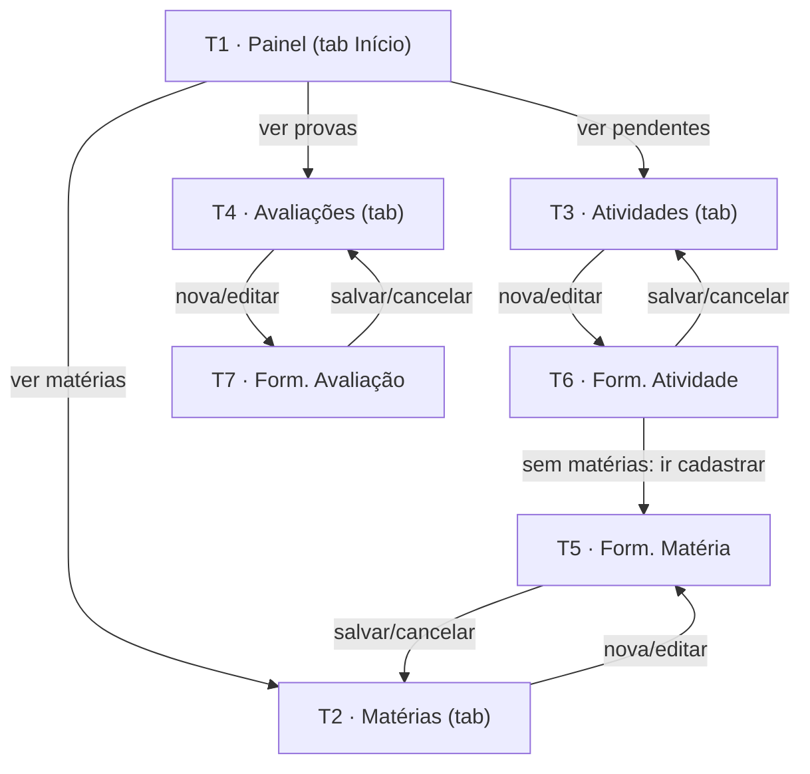

# Telas e Fluxo de Navegação — Studia

| Campo | Valor |
|---|---|
| **Status** | **Aprovado como base** (2026-10-07) — UI monocromática por [ADR-0006](../adr/ADR-0006-identidade-visual-monocromatica.md); convenção de rotas ajustada ao scaffold real (ver Notas) |
| **Origem** | Roteiro Etapa 1, item 4 (≥5 telas navegáveis) + RF-01…RF-09 |
| **Implementação** | Expo Router sobre o scaffold atual (`src/app/`, abas em `_layout.tsx`) — [ADR-0003](../adr/ADR-0003-estrategia-de-navegacao.md) |

## Mapa geral

As 4 primeiras telas são **abas** (já existentes no scaffold — `app-tabs`); as 3 telas de formulário são
**rotas modais/pushed** sobre a pilha. Total: **7 telas navegáveis** (mínimo do roteiro: 5). Cada tela de
listagem concentra seu CRUD para si mesma (listar + editar/excluir o próprio item), atendendo o RNF-01
de "≤2 toques para ação comum".

---

## T1 · Painel (tela inicial)

- **Objetivo:** responder em segundos "o que vence primeiro / o que falta / o que vem por aí" (RF-09).
- **Informações apresentadas:** saudação curta; total de atividades pendentes; lista compacta das próximas
  atividades com prazo (vencendo hoje/2 dias em destaque tipográfico — badge outline, sem cor); próximas
  avaliações (data + monograma da matéria); progresso geral (concluídas ÷ total, números grandes por
  escala tipográfica); progresso por matéria (top 3). Sem dados: estado inicial
  "Cadastre sua primeira matéria" (CA-09.2).
- **Ações/botões:** botão de cadastro rápido de atividade; toques nos blocos navegam; tabs de navegação.
- **Origem da navegação:** abertura do app (rota `(tabs)/index.tsx` → `screens/dashboard`, tab Início).
- **Destinos:** T3, T4, T2, T6 (via botões/blocos).
- **Dados utilizados:** leitura agregada das 3 coleções do storage (RF-09, CA-09.4). **Tela de origem do
  requisito "dados em tela" do roteiro item 9.**

## T2 · Matérias

- **Objetivo:** listar e gerenciar matérias (RF-02, RF-03).
- **Informações apresentadas:** cards por matéria: **monograma** (2 iniciais derivadas do nome, sem cor),
  nome, professor(a), N pendências, N avaliações agendadas, barra de progresso. Estado vazio orientando
  cadastro (CA-02.2).
- **Ações/botões:** FAB "+ Nova matéria"; toque no card abre edição; ação de excluir por card
  (confirmação — CA-03.3).
- **Origem:** tab Matérias (ou T1). **Destinos:** T5 (novo/edição).
- **Dados:** coleção `subjects` + agregações de `activities`/`assessments`.

## T3 · Atividades

- **Objetivo:** ver e priorizar o trabalho (RF-05, RF-06, RF-07).
- **Informações apresentadas:** FlatList ordenada por prazo (CA-05.1); filtros pendentes/todas/concluídas
  (segmented control monocromático); por item: título, matéria (monograma + nome), prazo com destaque
  tipográfico/badge outline para atrasadas e ≤2 dias (sem cor), checkbox de conclusão. Estado vazio
  específico por filtro (CA-05.4).
- **Ações/botões:** FAB "+ Nova atividade"; checkbox alternar situação (RF-06); toque no item abre edição;
  excluir com confirmação.
- **Origem:** tab Atividades (ou T1). **Destinos:** T6.
- **Dados:** coleção `activities` (+ monogramas de `subjects` para exibição).

## T4 · Avaliações

- **Objetivo:** ver o que será cobrado e quando (RF-08).
- **Informações apresentadas:** lista ordenada por data (agendadas primeiro — CA-08.3); por item: título,
  matéria (monograma + nome), data ("em 5 dias" / "hoje"), toggle agendada↔realizada; realizadas esmaecidas
  (`textTertiary` + tracejado) como histórico. Estado vazio orientando cadastro.
- **Ações/botões:** FAB "+ Nova avaliação"; alternar situação; toque abre edição; excluir com confirmação.
- **Origem:** tab Avaliações (ou T1). **Destinos:** T7.
- **Dados:** coleção `assessments` (+ `subjects`).

## T5 · Formulário de Matéria (RF-01/RF-03) — *formulário funcional com validação*

- **Objetivo:** criar ou editar uma matéria.
- **Campos:** Nome (obrigatório, ≥2 chars, único case-insensitive — OQ-12 resolvida); Professor(a)
  (opcional). **Não há campo de cor** — identificação visual é o monograma derivado
  ([ADR-0006](../adr/ADR-0006-identidade-visual-monocromatica.md)).
- **Validações:** por campo, inline, com mensagem específica ("Informe o nome da matéria." — CA-01.1);
  envio bloqueado com erro (RNF-04).
- **Botões:** **Salvar** e **Cancelar** (voltam à T2; sucesso com feedback — CA-01.4).
- **Origem:** T2. **Destinos:** T2. **Dados:** grava `subjects`.

## T6 · Formulário de Atividade (RF-04/RF-07)

- **Objetivo:** criar ou editar atividade.
- **Campos:** Título (obrigatório); Matéria (seletor, obrigatório); Tipo (4 opções); Prazo (data opcional,
  formatada, aviso se passada); Descrição (opcional).
- **Validações:** CA-04.1–CA-04.3; sem matérias cadastradas, seletor vira ponte para T5 (CA-04.4).
- **Botões:** Salvar / Cancelar → T3. **Origem:** T3, T1. **Dados:** grava `activities`.

## T7 · Formulário de Avaliação (RF-08)

- **Objetivo:** criar ou editar avaliação.
- **Campos:** Título (obrigatório); Matéria (obrigatório); Data (obrigatória; aviso se passada).
- **Validações:** CA-08.1–CA-08.2. **Botões:** Salvar / Cancelar → T4.
- **Origem:** T4, T1. **Dados:** grava `assessments`.

---

## Notas de implementação

- **Rotas (implementado — revisão 2026-10-07):** `_layout.tsx` da **raiz** é um `<Stack>` que contém o
  grupo de abas `(tabs)` e os 3 formulários como modal (`presentation: 'modal'`).
  Abas: `(tabs)/index.tsx` (Painel), `(tabs)/subjects.tsx`, `(tabs)/activities.tsx`,
  `(tabs)/assessments.tsx`. Formulários: `subject-form.tsx`, `activity-form.tsx`,
  `assessment-form.tsx` na raiz, com parâmetro `?id=` (ausente = criação). TypedRoutes habilitado.
  **As abas usam `Tabs` estável do expo-router com ícones `@expo/vector-icons` (Ionicons
  outline/preenchido) — NÃO `NativeTabs` (unstable): a barra nativa não renderiza no Expo Go
  (aparecia só no navegador). Ver ADR-0003 (revisão de 2026-10-07).**
- **Telas (ADR-0008):** a implementação de cada tela vive em `src/screens/` (dashboard, subjects,
  activities, assessments, subject-form, activity-form, assessment-form); os arquivos em `src/app/`
  são rotas-finas que só re-exportam. As descrições T1–T7 abaixo referem-se aos `src/screens/*`.
- **Telas (ADR-0008):** a implementação de cada tela vive em `src/screens/` (dashboard, subjects,
  activities, assessments, subject-form, activity-form, assessment-form); os arquivos em `src/app/`
  são rotas-finas que só re-exportam. As descrições T1–T7 abaixo referem-se aos `src/screens/*`.
- **Prazo** usa campo de data com máscara `DD/MM/AAAA` (sem dependência nova; sem DatePicker nativo).
- Protótipo visual das 7 telas: item do roteiro, ferramenta em OQ-08 — desenhar em P&B (ADR-0006).
