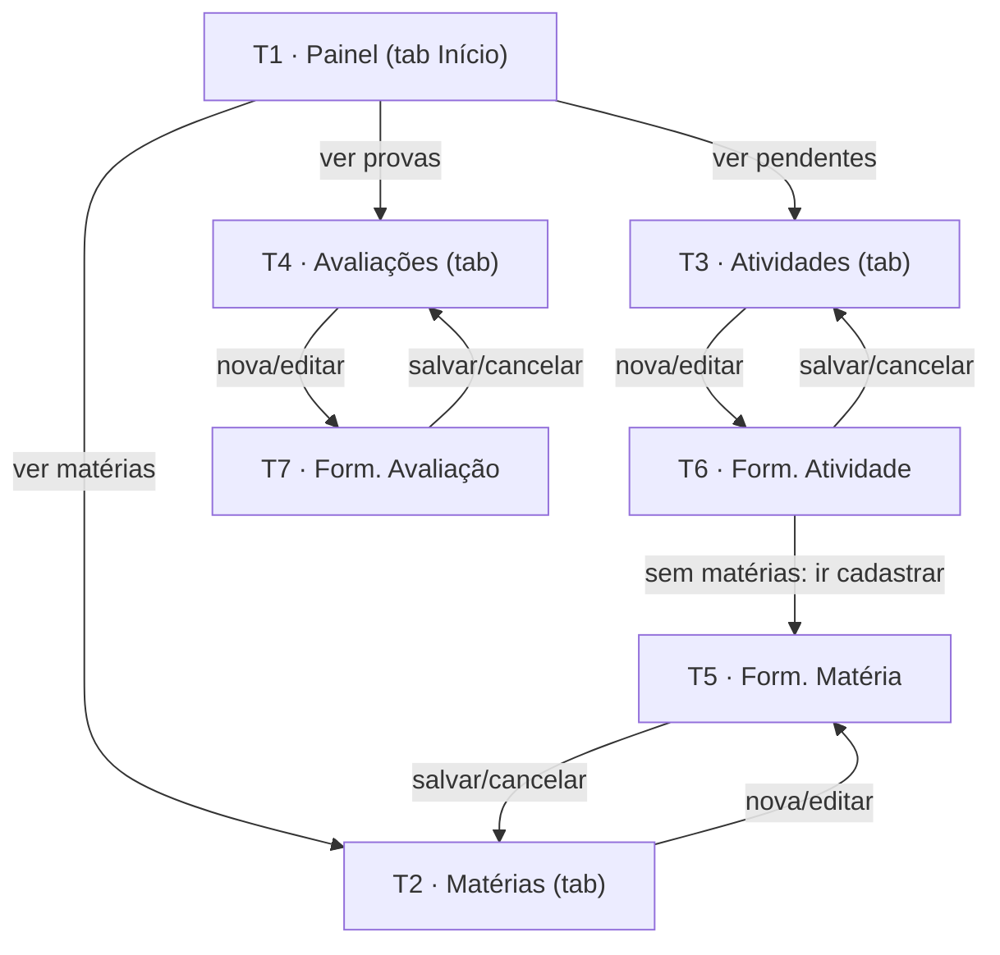

# Telas e Fluxo de Navegação — Studia

| Campo | Valor |
|---|---|
| **Status** | **Aprovado como base** (2026-10-07) — telas revisadas em 2026-10-08 pela identidade escura com cor de destaque ([ADR-0009](../adr/ADR-0009-identidade-visual-escura-com-destaque.md), que substitui o ADR-0006); convenção de rotas ajustada ao scaffold real (ver Notas) |
| **Origem** | Roteiro Etapa 1, item 4 (≥5 telas navegáveis) + RF-01…RF-09 |
| **Implementação** | Expo Router sobre o scaffold atual (`src/app/`, abas em `_layout.tsx`) — [ADR-0003](../adr/ADR-0003-estrategia-de-navegacao.md) |

## Mapa geral

As 4 primeiras telas são **abas** (já existentes no scaffold — `app-tabs`); as 3 telas de formulário são
**rotas modais/pushed** sobre a pilha. Total: **7 telas navegáveis** (mínimo do roteiro: 5). Cada tela de
listagem concentra seu CRUD para si mesma (listar + editar/excluir o próprio item), atendendo o RNF-01
de "≤2 toques para ação comum".

---

## T1 · Painel (tela inicial)

- **Objetivo:** responder em segundos "o que vence primeiro / o que falta / o que vem por aí" (RF-09).
- **Informações apresentadas:** saudação curta + data por extenso; **card principal** com o anel de
  progresso à esquerda e, à direita, "X de Y concluídas" e quantas vencem nos próximos 7 dias;
  lista **"Próximos prazos"** com as 3 próximas atividades pendentes (título, matéria com a bolinha da
  cor e chip de prazo por urgência); **próxima avaliação** (bloco de data, título, matéria e contagem
  regressiva), apenas se existir. Sem dados: estado vazio "Comece pela matéria" com atalho de cadastro
  (CA-09.2). Nenhum número repetido em dois blocos.
- **Ações/botões:** toque em item/lista abre a edição; atalho "Ver todas" vai para T3; abas.
- **Origem da navegação:** abertura do app (rota `(tabs)/index.tsx` → `screens/DashboardPage`, tab Início).
- **Destinos:** T3, T4, T6.
- **Dados utilizados:** leitura agregada das 3 coleções do storage (RF-09, CA-09.4). **Tela de origem do
  requisito "dados em tela" do roteiro item 9.**

## T2 · Matérias

- **Objetivo:** listar e gerenciar matérias (RF-02, RF-03).
- **Informações apresentadas:** cards por matéria: **ícone em quadrado 44×44 com fundo tingido na cor da
  matéria**, nome (2 linhas), professor(a), "N pendentes · N avaliações" e barra de progresso **na cor da
  matéria**. Estado vazio orientando cadastro (CA-02.2).
- **Ações/botões:** FAB "+ Nova matéria" (acima da tab bar); o card inteiro abre a edição; exclusão no
  formulário com confirmação (CA-03.3).
- **Origem:** tab Matérias (ou T1). **Destinos:** T5 (novo/edição).
- **Dados:** coleção `subjects` (inclui `color`) + agregações de `activities`/`assessments`.

## T3 · Atividades

- **Objetivo:** ver e priorizar o trabalho (RF-05, RF-06, RF-07).
- **Informações apresentadas:** lista ordenada por prazo (CA-05.1) e **agrupada por período** na ordem
  Atrasadas → Hoje → Esta semana → Depois (→ Sem prazo, quando houver); filtro em **controle segmentado
  único** (Pendentes / Todas / Concluídas) com transição suave; por item: checkbox circular animado,
  título em até 2 linhas, matéria com a bolinha da cor e chip de prazo à direita (cinza / alerta /
  urgente) — **cor sempre acompanhada de rótulo textual**. Estado vazio específico por filtro (CA-05.4).
- **Ações/botões:** FAB "+ Nova atividade"; checkbox alternar situação (RF-06); toque no item abre edição.
- **Origem:** tab Atividades (ou T1). **Destinos:** T6.
- **Dados:** coleção `activities` (+ `subjects` para a cor da matéria).

## T4 · Avaliações

- **Objetivo:** ver o que será cobrado e quando (RF-08).
- **Informações apresentadas:** cards ordenados por data (agendadas primeiro — CA-08.3); por card:
  **bloco de data à esquerda (dia grande, mês pequeno)**, título, matéria com a bolinha da cor e
  contagem regressiva ("em 5 dias"); realizadas esmaecidas e tracejadas como histórico. Estado vazio com
  ícone de calendário.
- **Ações/botões:** FAB "+ Nova avaliação"; alternar situação agendada↔realizada; toque abre edição.
- **Origem:** tab Avaliações (ou T1). **Destinos:** T7.
- **Dados:** coleção `assessments` (+ `subjects`).

## T5 · Formulário de Matéria (RF-01/RF-03) — *formulário funcional com validação*

- **Objetivo:** criar ou editar uma matéria.
- **Campos:** Nome (obrigatório, ≥2 chars, único case-insensitive — OQ-12 resolvida); Professor(a)
  (opcional); Carga horária (opcional, 1–200); **grade de ícones** (6 colunas × 12 ícones, inline);
  **seletor de cor** (8 bolinhas da paleta).
- **Validações:** por campo, inline, com mensagem específica ("Informe o nome da matéria." — CA-01.1);
  cor fora da paleta é recusada; envio bloqueado com erro (RNF-04).
- **Rodapé fixo:** **Salvar** (cor de destaque), **Excluir** (texto vermelho, `Alert` de confirmação) e
  **Cancelar** (texto neutro) → voltam à T2.
- **Origem:** T2. **Destinos:** T2. **Dados:** grava `subjects` (`hour`, `icon`, `color`).

## T6 · Formulário de Atividade (RF-04/RF-07)

- **Objetivo:** criar ou editar atividade.
- **Campos:** Título (obrigatório); Matéria (chips horizontais com a cor de cada uma, obrigatório);
  Tipo (Tarefa, Trabalho, Leitura, Estudo — chips com ícone, quebram linha); Prazo (campo que abre o
  calendário ao toque, com atalhos Hoje/Amanhã/Próxima semana; opcional, aviso se passada); Descrição
  (opcional, altura mínima 100).
- **Validações:** CA-04.1–CA-04.3; sem matérias cadastradas, o formulário vira ponte para T5 (CA-04.4).
- **Rodapé fixo:** Salvar / Excluir / Cancelar → T3. **Origem:** T3, T1. **Dados:** grava `activities`.

## T7 · Formulário de Avaliação (RF-08)

- **Objetivo:** criar ou editar avaliação.
- **Campos:** Título (obrigatório); Matéria (mesmos chips coloridos de T6, obrigatório); Data
  (obrigatória; campo que abre o calendário ao toque + atalhos; aviso se passada).
- **Validações:** CA-08.1–CA-08.2. **Rodapé fixo:** Salvar / Excluir / Cancelar → T4.
- **Origem:** T4, T1. **Dados:** grava `assessments`.

---

## Notas de implementação

- **Rotas (implementado — revisão 2026-10-07):** `_layout.tsx` da **raiz** é um `<Stack>` que contém o
  grupo de abas `(tabs)` e os 3 formulários como modal (`presentation: 'modal'`).
  Abas: `(tabs)/index.tsx` (Painel), `(tabs)/subjects.tsx`, `(tabs)/activities.tsx`,
  `(tabs)/assessments.tsx`. Formulários: `subject-form.tsx`, `activity-form.tsx`,
  `assessment-form.tsx` na raiz, com parâmetro `?id=` (ausente = criação). TypedRoutes habilitado.
  **As abas usam `Tabs` estável do expo-router com ícones `@expo/vector-icons` (Ionicons
  outline/preenchido) — NÃO `NativeTabs` (unstable): a barra nativa não renderiza no Expo Go
  (aparecia só no navegador). Ver ADR-0003 (revisão de 2026-10-07).**
- **Telas (ADR-0008):** a implementação de cada tela vive em `src/screens/` (dashboard, subjects,
  activities, assessments, subject-form, activity-form, assessment-form); os arquivos em `src/app/`
  são rotas-finas que só re-exportam. As descrições T1–T7 referem-se aos `src/screens/*`.
- **Header e criação (ADR-0009):** todas as telas usam `components/ui/ScreenHeader.tsx` (título +
  ações em linha, sem sobreposição) e a criação sai da **FAB**, não do header.
- **Prazo/data:** campo pressable que abre o calendário mensal em `Modal` nativo
  (`components/ui/DatePicker`), com atalhos Hoje/Amanhã/Próxima semana. Sem dependência nova — roda no
  Expo Go (ADR-0001/0007).
- Protótipo visual das 7 telas: item do roteiro, ferramenta em OQ-08 — desenhar na identidade escura com
  cor de destaque do [ADR-0009](../adr/ADR-0009-identidade-visual-escura-com-destaque.md).
