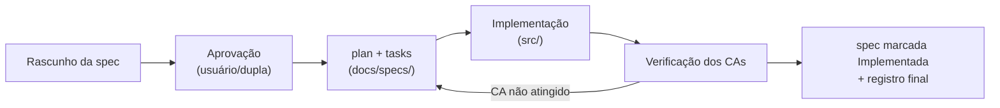

# Features — Studia

Divisão do produto em features. Cada feature terá **uma especificação própria** (`spec.md`), escrita a
partir do [`_template-spec.md`](_template-spec.md) **antes** de qualquer implementação (Regra 3 do
[`.clinerules`](../../.clinerules)).

## Catálogo proposto

| Feature | Escopo | RF atendidos | Depende de | Spec de execução | Status |
|---|---|---|---|---|---|
| `ui-kit/` | Componentes reutilizáveis (≥3 exigidos pelo roteiro), tokens de tema, estados vazios/erro | base de RNF-01, RNF-02, RNF-05 | — | [slice 1](../specs/2026-10-07-slice-1-navigation-uikit/spec.md) | Proposta — spec não escrita |
| `subjects/` | CRUD de matérias + validação do formulário (o "formulário com validação" da Etapa 4) | RF-01, RF-02, RF-03 | ui-kit | [slice 2](../specs/2026-10-07-slice-2-subjects/spec.md) | Proposta — spec não escrita |
| `activities/` | CRUD de atividades, filtros por situação, ordenação por prazo, conclusão | RF-04, RF-05, RF-06, RF-07 | subjects, ui-kit | [slice 3](../specs/2026-10-07-slice-3-activities/spec.md) | Proposta — spec não escrita |
| `assessments/` | Cadastro/listagem de avaliações, situação agendada/realizada | RF-08 | subjects, ui-kit | [slice 4](../specs/2026-10-07-slice-4-assessments/spec.md) | Proposta — spec não escrita |
| `dashboard/` | Painel inicial com agregados e progresso | RF-09 | subjects, activities, assessments, ui-kit | [slice 5](../specs/2026-10-07-slice-5-dashboard/spec.md) | Proposta — spec não escrita |

> **A camada `features/<slug>/spec.md` (contrato permanente) será escrita quando a feature for
> implementada** — hoje ela só existe em forma de spec de execução fatiada (slice 0–5) e dos prompts de
> implementação ([../execution-prompts.md](../execution-prompts.md)). Use o
> [`_template-spec.md`](_template-spec.md) como base da spec de feature ao fechar cada slice (Regra 7).

## Por que esta divisão

- **Uma feature por entidade agregada** (subjects/activities/assessments) segue o domínio de 3 entidades e
  mantém specs pequenas e verificáveis.
- **`ui-kit` separada** porque o roteiro exige componentes reutilizáveis usados em múltiplas telas — ela
  é pré-requisito transversal, não parte de uma tela específica.
- **`dashboard` separada** porque é a única feature que compõe leitura das três coleções — seu risco está
  em agregação/atualização, mérito de spec própria.
- Nenhuma feature adicional foi criada por cosmética: login, calendário, notificações e notas estão
  classificadas em [product-brief.md](../product-brief.md) §7 como pós-MVP/descartadas.

## Ciclo de vida de uma spec

**Estados da spec:** `Proposta` → `Aprovada` → `Implementando` → `Implementada` → (ou `Superada`).
Mudança de escopo durante implementação: atualizar a spec primeiro, com justificativa (Regra 3).
